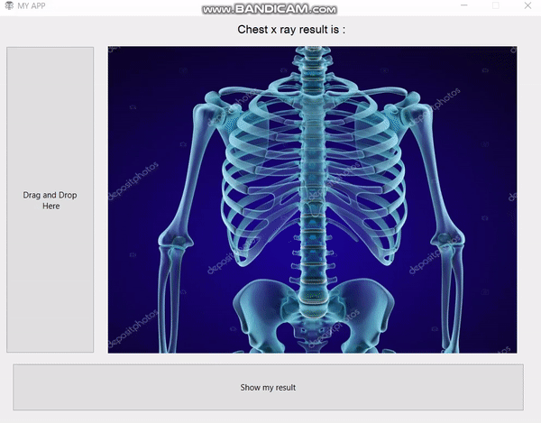

# My Projects:

# [Project 1: 3D Image Reconstruction](https://github.com/tural327/3d-image-reconstruction)
Making 3D reconstruction I need find 3d points of image. In that project I will be using 2 images for making 3D points. To make it we need to do several steps such as:
* Camera calibration -  using [opencv library](https://docs.opencv.org/3.4.15/dc/dbb/tutorial_py_calibration.html)
* Finding EssentialMatrix - I find key points and I find matched points for both images
* recoverPose algorithm help us to find second camera params : **points, R_est, t_est, mask_pose**
* At the end was finding homogon 3d points of images **cv2.triangulatePoints(P1,P2,xy_undistorted1,xy_undistorted2)**

# [Project 2: Chest-X-Ray](https://github.com/tural327/Chest-X-Ray-with-app)

* Application buid for detecting Normal and Pneumonia lung. Data downloaded from Kaggle.com. You just need drag and drop your X-Ray result to see answer 
Project steps:
1. create input for training
2. Building Convolutional Neural Network and display results
3. Make desktop GUI by using Pyqt6

# [Project 3: Fish classifier and segmentation](https://github.com/tural327/Fish_classifier_desk_app)
* Application built base on kaggle dataset and making classification fish types ("Black Sea Sprat","Gilt-Head Bream","Hourse Mackerel","Red Mullet","Red Sea Bream","Sea Bass","Shrimp","Striped Red Mullet","Trout")

Project have several parts 
1. Building U-net model
2. Buildig image classification model
3. Apply all saved model to Pyqt5 app

# [Poject 4: Price Prediction](https://github.com/tural327/price_pred_full_project)
 Project purpose is to make a price prediction of home at Canada BC
 Project steps:
 1. Scraping data from [kijiji](https://www.kijiji.ca/)
 2. Making cleaning and feature extarcting from data
 3. By using sklearn regressor and finding best model for my data
 4. Build Flask web app to make prediction
 

# [Project 5: Face Recognition](https://github.com/tural327/face_recognition)
Project purpose was classification of face images using simple Cv2 face detection module 
For building python script I need collect data so I am going to use Bill Gates,Jak Ma,Elon Musk and my image
* Before applying classification model I need crop face images from my data
* Second I trained my face models by using tensorflow image classification
* Now applying model to my script by detecting face and making prediction

